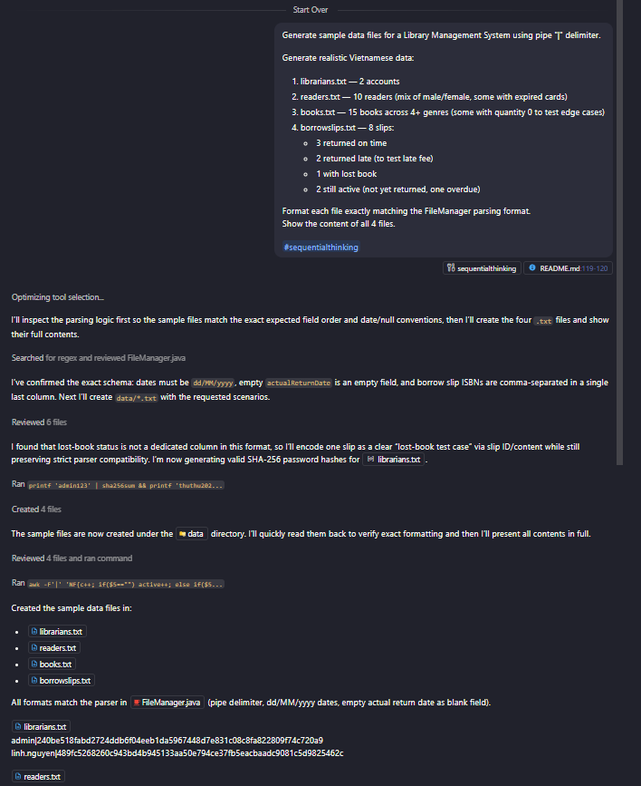
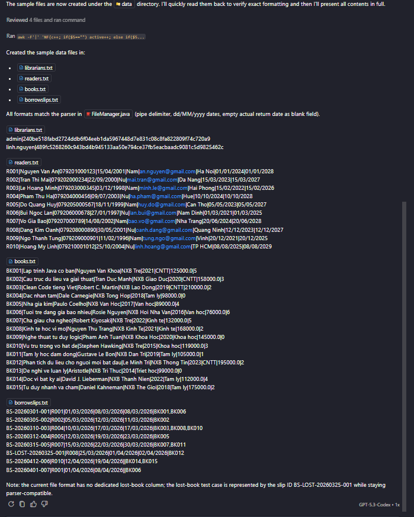
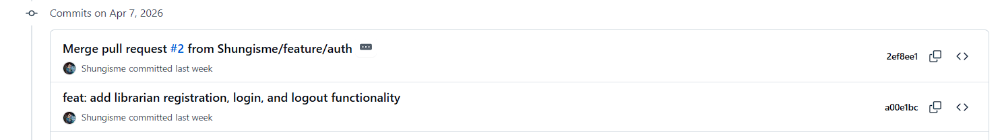
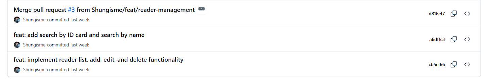
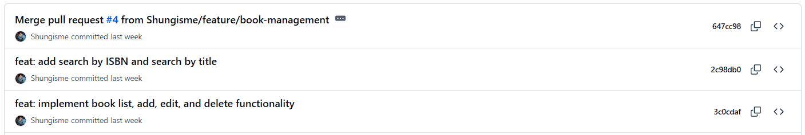
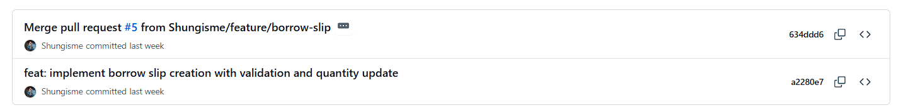
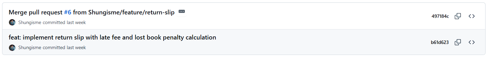
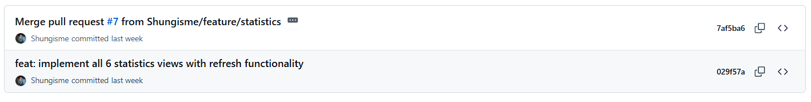

# WORK PROGRESS REPORT

## Topic

Library Management System

## PART 1 — STUDENT INFORMATION

| Item              | Information                  |
| ----------------- | ---------------------------- |
| Student ID        | 22120118                     |
| Full Name         | Vong Sau Hung                |
| Class             | CQ2024-7                     |
| Course            | Java Application Programming |
| Lecturer          | MSc Nguyen Van Khiet         |
| AI Usage Rate (%) | 30%                          |

## PART 2 — AI USAGE DECLARATION (Form B)

### 2.1 AI Tools Used

| AI tool, version, and platform                                   | Access time (date, hour) | Prompt used                                                                           | Purpose of use                                              | AI-generated content                                                                                                       | Student's own work / edits / validation                                                                                    |
| ---------------------------------------------------------------- | ------------------------ | ------------------------------------------------------------------------------------- | ----------------------------------------------------------- | -------------------------------------------------------------------------------------------------------------------------- | -------------------------------------------------------------------------------------------------------------------------- |
| GitHub Copilot (GPT-5.3-Codex), integrated in Visual Studio Code | 16/04/2026, 20:10        | Generate sample data files for a Library Management System using pipe "\|" delimiter. | Generated sample datasets for the library system data files | Generated sample content for `librarians.txt`, `readers.txt`, `books.txt`, `borrowslips.txt` in `\|`-delimited format      | Reviewed all generated data, corrected date values, checked consistency across readers, books, and borrow/return scenarios |
| GitHub Copilot (GPT-5.3-Codex), integrated in Visual Studio Code |                          |                                                                                       | Accelerated repeated code patterns using code suggestions   | Suggested code skeletons for model/service/UI (attributes, getters/setters, constructors, panel skeletons, basic handlers) | Reviewed all suggested code, adjusted business logic, refactored where needed, and manually tested before commit           |

### 2.2 AI Citation

- Copilot. GPT-5.3-Codex, GitHub via Visual Studio Code, accessed 20:10 on April 17, 2026, prompt: "Generate sample data files for a Library Management System using pipe "|" delimiter.", used to create sample datasets for the library system; AI generated draft records for `librarians.txt`, `readers.txt`, `books.txt`, `borrowslips.txt`; student reviewed, corrected date values, and validated scenario consistency.

### 2.3 Required Evidence Checklist (attached appendix)

Appendix: prompt history evidence for sample data generation:

## PART 3 — FEATURE EVALUATION TABLE

| No. | Feature                                                                                                                                                                                                                       | Completion Status | Notes | Git Commits                                                  |
| --- | ----------------------------------------------------------------------------------------------------------------------------------------------------------------------------------------------------------------------------- | ----------------- | ----- | ------------------------------------------------------------ |
| 1   | Create librarian account.                                                                                                                                                                                                     |                   |       |                            |
| 2   | Login, logout.                                                                                                                                                                                                                |                   |       |                            |
| 3   | Reader management. 1. View reader list in the library 1. Add a reader 1. Edit reader information 1. Delete reader information 1. Search reader by ID card/CCCD 1. Search reader by full name                |                   |       |  |
| 4   | Book management 1. View all books in the library 1. Add a book 1. Edit book information 1. Delete a book 1. Search book by ISBN 1. Search book by title                                                     |                   |       |      |
| 5   | Create borrow slip                                                                                                                                                                                                            |                   |       |              |
| 6   | Create return slip                                                                                                                                                                                                            |                   |       |              |
| 7   | Basic statistics 1. Total number of books in library 1. Number of books by genre 1. Total number of readers 1. Number of readers by gender 1. Number of currently borrowed books 1. List of overdue readers |                   |       |                |
